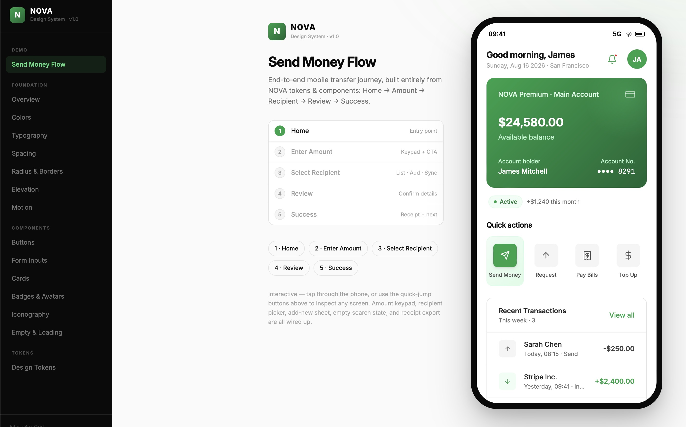

# NOVA 2 Fintech Design System v1.0

A systematic design foundation and React 19 component library engineered for high-trust financial products.

---

## 📱 Mobile Flow demo
- **Live Preview:** [https://jolly-genie-0d17b6.netlify.app](https://jolly-genie-0d17b6.netlify.app)
- **Figma Make:** [NOVA Fintech Design System](https://www.figma.com/make/mi7kEHG7bztgyTJEMjFJ45/NOVA-Fintech-Design-System?t=iDywCezWnRT1yxTi-1)
- **Figma Design:** [Nova Design](https://www.figma.com/design/6xzNmO2q2TbsDNrsaOtu6c/Nova-design?node-id=1-2&t=Bw8TSSBXn7ywq6JF-1)
- **Journey:** End-to-end interactive "Send Money" flow (Loading → Home → Amount → Recipient → Review → Success) built entirely with NOVA tokens & components.



---

## 📦 Installation
```bash
npm install nova-fintech-design-system
# or
pnpm add nova-fintech-design-system
```
Import tokens and components directly in your React 19 project:
```tsx
import { Button, Input } from 'nova-fintech-design-system';
import 'nova-fintech-design-system/style.css';
```

---

## 🎯 The Problem & Solution
- **The Challenge:** Most design systems use automatic line-heights, causing inconsistent vertical symmetry across component groups and financial amounts.
- **The Solution:** Defined strict line-height rules (**100%** for sizes $\ge$ 32px; **130%** for sizes < 32px) across typography, achieving absolute symmetry and consistency.

---

## 🏗️ Design System Structure
Structured into a modular, production-ready architecture:
1. **Design Tokens (`src/tokens/`):** 3-tier hierarchy (Primitive values → Semantic intent roles → Component tokens).
2. **Component Library (`src/components/`):** Buttons (7 variants), Inputs/Checkboxes/Toggles, Cards, Badges, Avatars, Icons, and Loading/Empty states.
3. **Application Flows (`src/SendMoneyFlow.tsx`):** Real-world fintech transaction flows validating system scalability.

---

##  My AI Workflow & Engineering Journey
- **Planning & Foundations:** Used ChatGPT to define brand personality, foundations, tokens, and fintech-specific components.
- **Visual Prototyping:** Translated summaries into prompts for Figma Make to generate initial visual drafts.
- **Accessibility Validation:** Duplicated components/tokens to validate WCAG 2.0 AA compliance, refining overlooked details in Figma Make.
- **Library Scaffolding & Flow:** Saved project locally, using Opencode to structure it into an npm-installable library and build the Send Money flow screens + documentation (`README.md`, `CLAUDE.md`).
- **Where AI Failed & Fixed:** Opencode generated `tokens.json` for direct Figma import, but failed to correctly resolve semantic variables. *Fix:* Manually audited and defined semantic variables.

---

## What i retained, changed and why
- **Retained:** Institutional financial green palette (`#16A34A`), robust data table layouts, and high WCAG contrast standards.
- **Changed:** Replaced default auto line-heights with precise 100% / 130% rules to eliminate symmetry drift; restructured flat tokens into a clean 3-tier system.

---

## 🚀 If I Had More Time
1. Comprehensive component documentation with do’s and don’ts.
2. Advanced WCAG accessibility audits for interactions and states.
3. Real-world scenario testing and edge case hardening.
4. Fintech-specific data visualization (Analytics, spending graphs, expense charts).

---

## 📐 Design Foundations & Tech Stack

### 1. Color System (`src/tokens/colors.ts`, `primitives.ts`)
- **Nova Green Scale:** Anchored at `#16A34A` across 10 precise steps (`50` through `900`) for institutional financial confidence.
- **Neutral Scale:** 11-step neutral palette (`50` to `950`) providing high contrast and subtle background surfaces.
- **Semantic Intent Colors:**
  - **Success:** `#16A34A` (Positive outcomes, confirmed states)
  - **Warning:** `#F59E0B` (Caution, pending states)
  - **Error:** `#DC2626` (Failures, destructive actions)
  - **Info:** `#2563EB` (Informational guidance)
- **Gradients:** Hero linear gradients (`--gradient-hero`), surface, card, and accent gradients.

### 2. Typography (`src/tokens/typography.ts`)
- **Font Family:** Inter (Regular 400, Medium 500, Semibold 600, Bold 700).
- **Line-Height Rule:** 
  - **100% line height** for sizes $\ge$ 32px (Display, Heading 1) for tight, impactful financial figures.
  - **130% line height** for sizes < 32px (Heading 2 through Caption) for comfortable legibility.

### 3. Spacing & Grid (`src/tokens/scale.ts`)
- **Base Grid:** 8px systematic grid system.
- **Scale:** 0px, 2px, 4px, 6px, 8px, 12px, 16px, 20px, 24px, 32px, 40px, 48px, 64px, 80px, 96px.

### 4. Radius & Borders (`src/tokens/scale.ts`)
- **SM (4px):** Tags, small chips, minor accents.
- **MD (8px):** Buttons, form inputs, dropdowns, navigation items.
- **LG (12px):** Cards, panels, modals, page sections.
- **Full (9999px):** Badges, pills, avatars, toggles.
- **Borders:** Hairline default (`#E5E5E5`), primary (`#DCFCE7`), strong (`#D4D4D4`).

### 5. Elevation & Motion (`src/tokens/scale.ts`, `typography.ts`)
- **Elevation (5 levels):** Flat-first approach with shadow levels Level 0 (none) through Level 4 (deep overlay).
- **Motion:** Duration scale (`100ms` to `700ms`) and easing curves (`--ease-out`, `--ease-in`, `--ease-in-out`, `--ease-spring`).

---

## Component Inventory (`src/components/`)
- **Buttons (`Button.tsx`):** 7 variants (Primary, Secondary, Ghost, Outline, Destructive, Black, White) across 3 sizes (`sm` 32px, `md` 40px, `lg` 48px) and 5 interactive states.
- **Form Inputs (`Input.tsx`, `Checkbox.tsx`, `Toggle.tsx`):** Text inputs, select dropdowns, checkboxes, toggles, with explicit focus/error rings.
  - *Rule:* Inline input + button pairs with icons must both maintain a fixed `h-10` (40px) height.
- **Cards (`Card.tsx`):** Metric cards, Account cards, Gradient payment cards, Transaction lists, and standard cards.
- **Badges & Avatars (`Badge.tsx`, `Avatar.tsx`):** Status badges (Success, Warning, Error, Info, Neutral) and avatars ranging from XS (24px) to XL (56px) with status indicators and stacked groups (`AvatarGroup`).
- **Iconography (`Icon.tsx`):** Lucide-style stroke icons at 1.75px width on 24×24 viewports (`ICON_PATHS`).
- **Empty & Loading States (`EmptyState.tsx`):** Intentional empty states with CTAs and skeleton loaders (`Skeleton`, `Spinner`).

---

## Tech Stack & Architecture
- **Runtime & Framework:** React 19, TypeScript 5.7
- **Styling:** Tailwind CSS v4 (`@tailwindcss/vite`), CSS custom properties
- **Build Tooling:** Vite 8, `oxfmt`
- **Design Tokens:** 3-tier architecture (`src/tokens/`: Primitive → Semantic → Component)

---

## Scripts & Development
- `pnpm dev` — Start Vite development server
- `pnpm build` — Build production bundle
- `pnpm preview` — Preview production build locally
- `pnpm format` — Format codebase with `oxfmt`